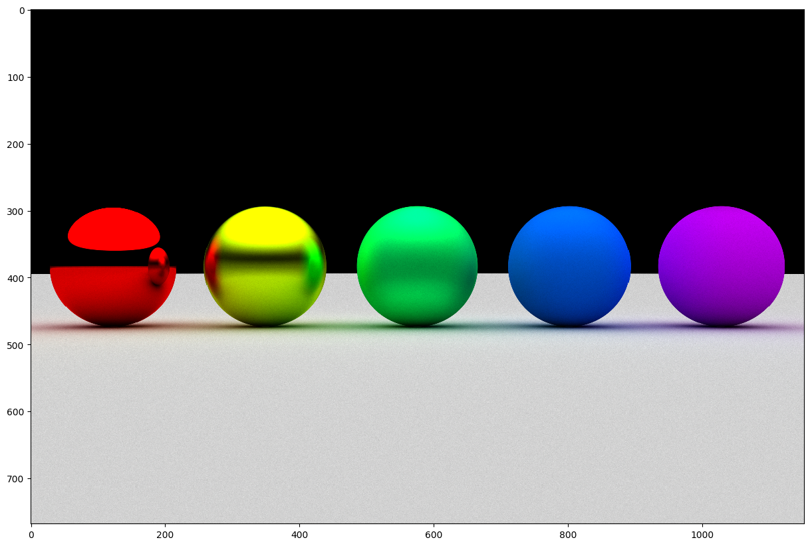
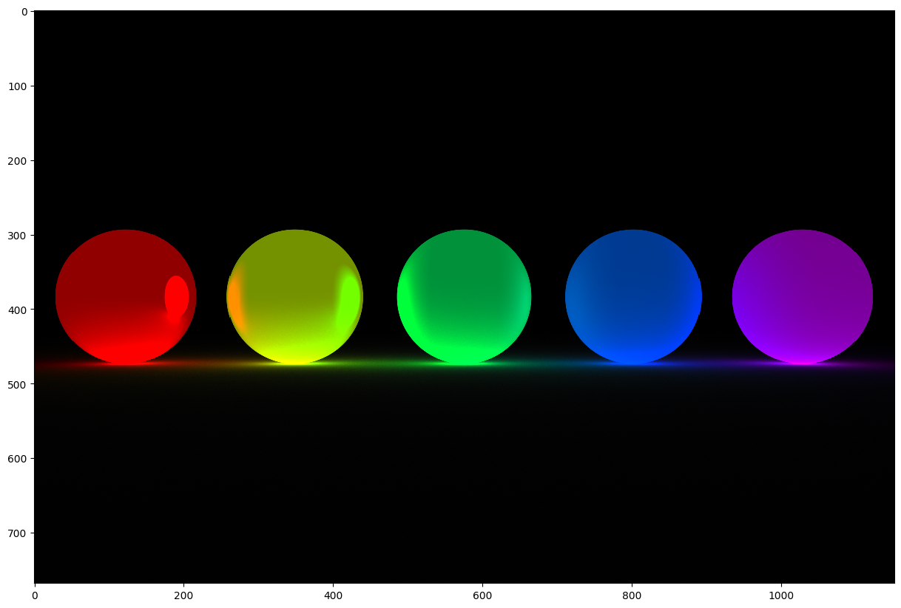
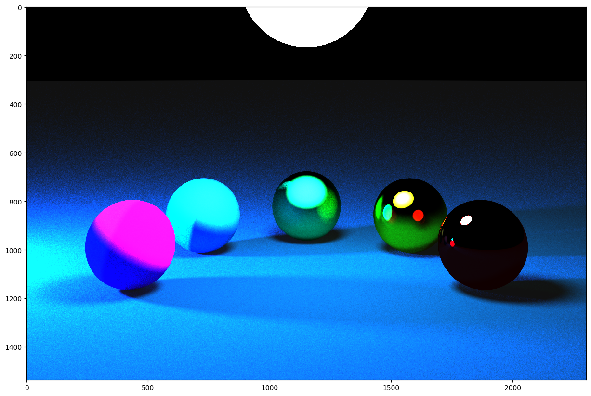
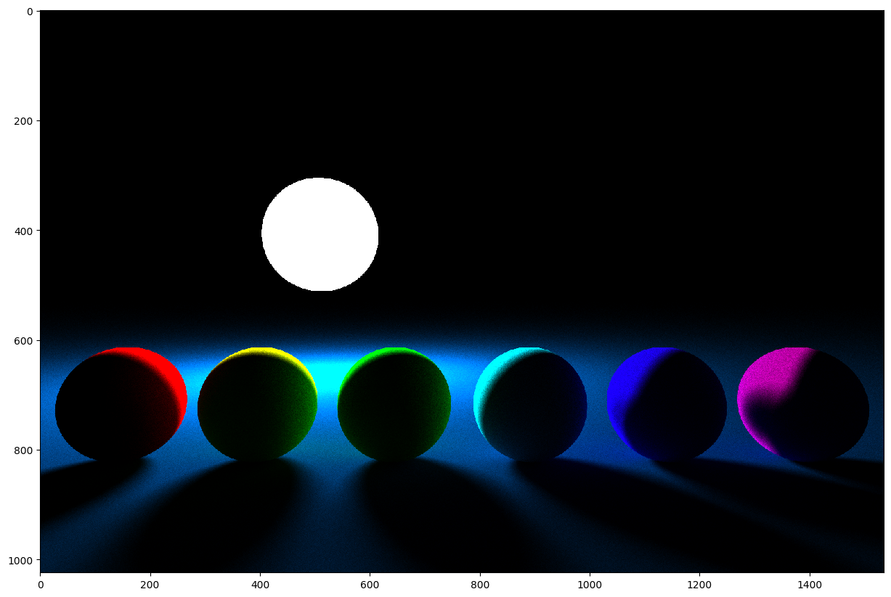
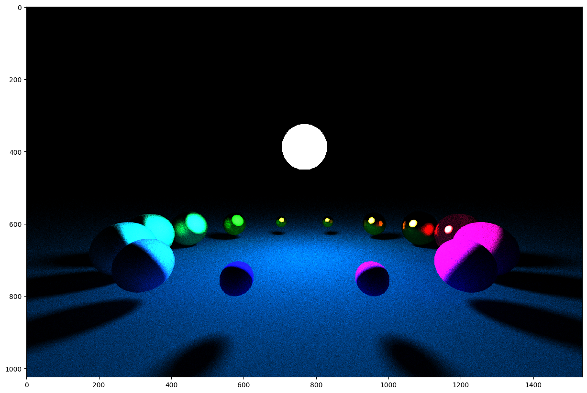

# Simple raytracing renderer in Jax

Supports
- Basic deterministic ray casting
- Stochastic path tracing with _many_ rays per pixel (batched or progressive)
- Specular and diffuse reflections
- Emissive materials and diffuse interreflection
- Antialiasing

The renderer is fully jitted and batches render calls along the #rays and viewplane pixels dims, see:
https://github.com/schmidtdominik/jax-raytracing/blob/2da55e9e2441536391e75b85016da2a2aa348505/raytrace.py#L34-L37

## Samples

### Specular and diffuse reflection

### Emissive materials

### Shadows & occlusion

Video sample [here](https://github.com/schmidtdominik/jax-raytracing/raw/main/samples/video.mp4) (very few traces per frame -> very noisy).
